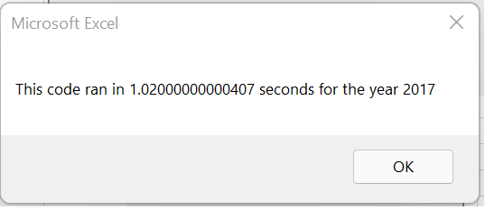
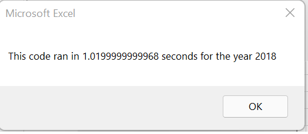
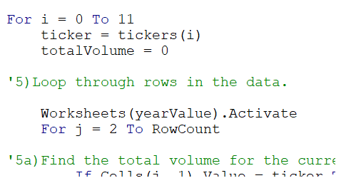
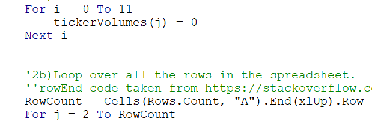
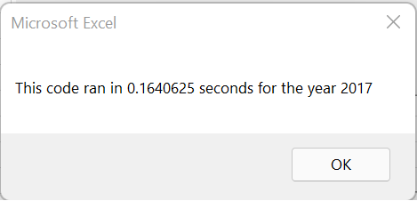
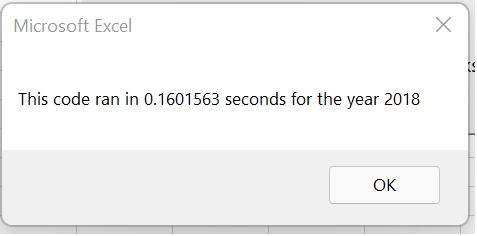

# VBABrianWashu
# Kickstarting with VBA

## Overview of Project
This project is to understand VBA coding and help Steve pull, condense, and present information to make accurate decisions for his parent's investment. 
## Results
We worked with Steve in getting information for his parent's investment plan. The information will help him present to clients to make good decision for their invessments. We first wrote code to gather information for him which took around 1 second for the program. This data set was around a dozen stocks.\
\

Now say he wanted information from a data set of thousands of stocks. This could take quite a bit longer. Refactoring will help us look for areas of improvement to make the code more efficient. We found a key issue between the two codes which focused on 1 "for" loop. 
Original Code:\ 

Refactor Code:\

The original code wants VBA to go through the data base each stock option we are looking at. When the refactor code only goes through the entire data base 1 time getting all the information needed for Steve. This improved the code execution speed dramatically.\
\

## Summary

-What are the advantages or disadvantages of refactoring code?
Advantages: Code executes better causing faster information gathering, more accurate, more reliable, better understanding.
Disadvantages: May take information out which was needed, multiple people working on 1 code causing team or coding issues, can change an option which customers may have liked. 

-How do these pros and cons apply to refactoring the original VBA script?
Pros: the refactoring made the code run faster. This will allow Steve to look at more stocks quicker and faster. This may give Steve the option to take more clients on for this business. Cons: Steve may not fully understand the change to the code and can't fix it for any issues or work on it to improve it. 
